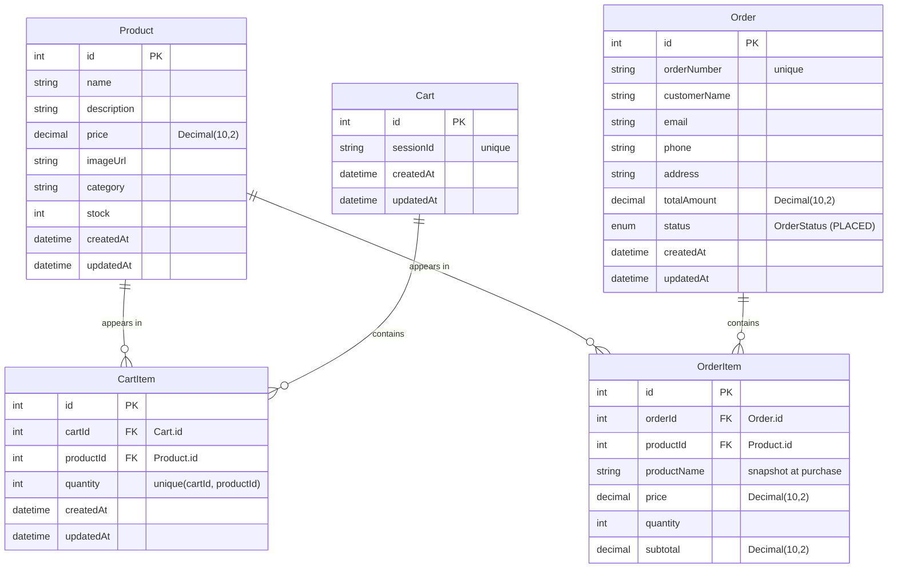

# ShopEase — Backend

The REST API for **ShopEase**, an e-commerce storefront. Built with Express and Prisma over PostgreSQL, and designed to serve the ShopEase frontend (React/Vite, separate repo).

## Tech Stack

| Tool | Purpose |
| --- | --- |
| Node.js | Runtime |
| Express 4 | HTTP server & routing |
| Prisma 5 | ORM / database layer |
| PostgreSQL | Database |
| Helmet | Security headers |
| Cors | Cross-origin access for the frontend |
| Morgan | Request logging |
| dotenv | Environment configuration |
| Jest + Supertest | Unit & API tests |

## Quick Start

```bash
npm install              # install dependencies
cp .env.example .env     # configure DATABASE_URL etc.
npx prisma migrate deploy # apply migrations to the database
npx prisma db seed        # load products into the database
npm run dev               # start the API (default http://localhost:5000)
```

Other scripts:

```bash
npm start     # production start
npm test      # run the test suite
npm run lint  # ESLint
npm run db:seed
```

## Environment Variables

| Variable | Description |
| --- | --- |
| `PORT` | Port the server listens on (default `5000`) |
| `DATABASE_URL` | PostgreSQL connection string (e.g. a Neon URI with `sslmode=require`) |
| `CLIENT_URL` | Origin allowed by CORS (the frontend URL, e.g. `http://localhost:5173`) |
| `NODE_ENV` | `development` / `production` |

`.env` is git-ignored. Do not commit real credentials — the committed `.env.example` holds placeholders.

## Folder Structure

```
server/
├── prisma/
│   ├── migrations/        # SQL migration history
│   ├── schema.prisma      # data models & relationships
│   └── seed.js            # product seeding script
├── src/
│   ├── app.js             # Express app (middleware + route mounting)
│   ├── server.js          # entry point
│   ├── routes/            # URL → controller mapping
│   │   ├── productRoutes.js
│   │   ├── cartRoutes.js
│   │   ├── orderRoutes.js
│   │   └── healthRoutes.js
│   ├── controllers/       # HTTP layer (params/body validation, responses)
│   │   ├── productController.js
│   │   ├── cartController.js
│   │   └── orderController.js
│   ├── services/          # business logic / Prisma queries
│   │   ├── productService.js
│   │   ├── cartService.js
│   │   └── orderService.js
│   ├── middleware/
│   │   └── errorHandler.js
│   └── utils/
│       └── prisma.js      # shared Prisma client instance
├── __tests__/             # Jest + Supertest API tests
├── package.json
└── .env.example
```

Request flow: `route → controller → service → Prisma → PostgreSQL`

## API Endpoints

Base URL: `/api`

| Method | Endpoint | Description |
| --- | --- | --- |
| GET | `/products` | List products. Query: `page`, `limit`, `category`, `q` |
| GET | `/products/:id` | Product detail |
| GET | `/cart/:sessionId` | Fetch cart by session id |
| POST | `/cart/:sessionId/items` | Add item `body: { productId, quantity }` |
| PATCH | `/cart/:sessionId/items/:itemId` | Update quantity `body: { quantity }` |
| DELETE | `/cart/:sessionId/items/:itemId` | Remove item |
| POST | `/orders` | Place order `body: { sessionId, customerName, email, phone, address }` |
| GET | `/orders` | Orders by email `query: email` |
| GET | `/orders/:orderNumber` | Single order by order number |
| GET | `/health` | Liveness check |

## Database Schema (ER Diagram)



Notes
- `CartItem` has a composite unique key on `(cartId, productId)` — one row per product per cart.
- `CartItem` and `OrderItem` cascade-delete with their parent (`Cart` / `Order`).
- `OrderItem.productName` is a snapshot so order history survives product edits/deletion.
- `OrderStatus` enum currently has a single value (`PLACED`) — extend for shipped/delivered states.

## Deployment (Render)

| Field | Value |
| --- | --- |
| Build | `npm install && npx prisma generate && npx prisma migrate deploy` |
| Start | `npm start` |
| Env | `DATABASE_URL` (Neon direct connection), `CLIENT_URL` (frontend origin), `NODE_ENV=production` |

Point the frontend's `VITE_API_URL` at the deployed base URL + `/api`.